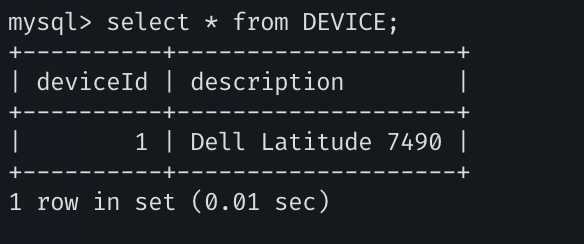
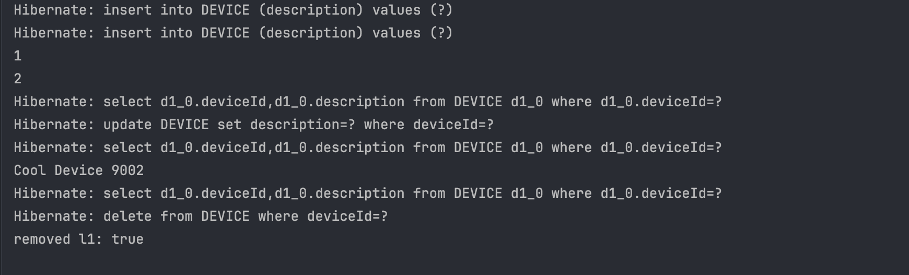
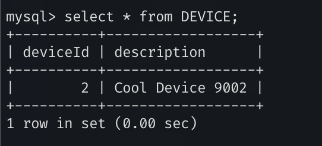

# jpa jakarta

### 2.



### 3.

```java
public Device load(int deviceId) {
        EntityManager em = emf.createEntityManager();
        try {
            Device device = em.find(Device.class, deviceId);
            return device;
        } finally {
            em.close();
        }
    }
```

### 4.

```java
public boolean updateDescription(int id, String newDescription) {
        EntityManager em = emf.createEntityManager();
        em.getTransaction().begin();
        try {
            Device device = em.find(Device.class, id);
            if (device == null) {
                em.getTransaction().rollback();
                return false;
            }
            device.setDescription(newDescription);
            em.merge(device);
            em.getTransaction().commit();
            return true;
        } catch (Exception e) {
            em.getTransaction().rollback();
            return false;
        } finally {
            em.close();
        }
    }
```

### 5.

```java
 public boolean remove(int id) {
        EntityManager em = emf.createEntityManager();
        em.getTransaction().begin();
        try {
            Device device = em.find(Device.class, id);
            if (device == null) {
                em.getTransaction().rollback();
                return false;
            }
            em.remove(device);
            em.getTransaction().commit();
            return true;
        } catch (Exception e) {
            em.getTransaction().rollback();
            return false;
        } finally {
            em.close();
        }
    }
```

## How was tested

With following main:

```java
    public static void main(String[] args) {
    	Dao dao = new Dao();
        Device l1 = new Device("Dell Latitude 7490");
        Device l2 = new Device("Cool Device 9001");

        dao.save(l1);
        dao.save(l2);

        System.out.println(l1.getDeviceId());
        System.out.println(l2.getDeviceId());

        dao.updateDescription(l2.getDeviceId(), "Cool Device 9002");

        Device l2Again = dao.load(l2.getDeviceId());
        System.out.println(l2Again.getDescription());

        boolean removed= dao.remove(l1.getDeviceId());
        System.out.println("removed l1: "+removed );
    }
```

got following result:



verified in db:


