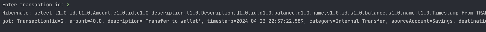
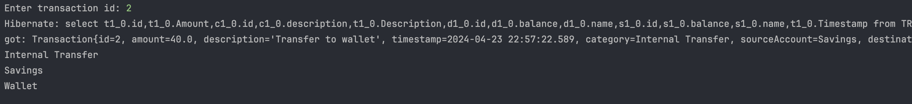

# One to many

### 2.

In `entity/Transaction.java`

```java
    @ManyToOne
    @JoinColumn(name = "CategoryId", referencedColumnName = "id")
    private Category category;

    @ManyToOne
    @JoinColumn(name = "SourceAccountId", referencedColumnName = "id")
    private Account sourceAccount;

    @ManyToOne
    @JoinColumn(name = "DestinationAccountId", referencedColumnName = "id")
    private Account destinationAccount;
```

other entity code is irrelavant copypasta

### 3.

FinanceTest.java

```java
public class FinanceTest {
    public static void main(String[] args) {
        Dao dao = new Dao();

        Category leisure = dao.createCategory("Leisure");
        Category gifts = dao.createCategory("Gifts");
        Category transfer = dao.createCategory("Internal Transfer");

        Account savingsAccount = dao.createAccount("Savings", 400.00f);
        Account wallet = dao.createAccount("Wallet", 14.50f);

        dao.createTransaction(null, savingsAccount, gifts, 100.00f, "Gift from Aunt Mary");

        dao.createTransaction(savingsAccount, wallet, transfer, 40.00f, "Transfer to wallet");

        dao.createTransaction(wallet, null, leisure, 8.40f, "Spent in pub");
    }
}

```

the dao methods

```java
    public Category createCategory(String description) {
        EntityManager em = emf.createEntityManager();
        em.getTransaction().begin();
        Category category = new Category();
        category.setDescription(description);
        em.persist(category);
        em.getTransaction().commit();
        em.close();
        return category;
    }

    public Account createAccount(String name, float initialBalance) {
        EntityManager em = emf.createEntityManager();
        em.getTransaction().begin();
        Account account = new Account();
        account.setName(name);
        account.setBalance(initialBalance);
        em.persist(account);
        em.getTransaction().commit();
        em.close();
        return account;
    }

    public Transaction createTransaction(Account source, Account destination, Category category, float amount, String description) {
        EntityManager em = emf.createEntityManager();
        em.getTransaction().begin();
        Transaction transaction = new Transaction();
        transaction.setSourceAccount(source);
        transaction.setDestinationAccount(destination);
        transaction.setCategory(category);
        transaction.setAmount(amount);
        transaction.setDescription(description);
        transaction.setTimestamp(new java.sql.Timestamp(System.currentTimeMillis()));
        em.persist(transaction);
        em.getTransaction().commit();
        em.close();
        return transaction;
    }
```

### 4.

FinanceTest2.java

```java
public class FinanceTest2 {
    public static void main(String[] args) {
        Dao dao = new Dao("FinanceTest2PU");
        Scanner sc = new Scanner(System.in);
        System.out.print("Enter transaction id: ");
        int id = sc.nextInt();
        Transaction transaction = dao.getTransaction(id);
        if (transaction == null) {
            System.out.println("failed to get");
        } else {
            System.out.println("got: " + transaction);
        }
    }
}
```

Dao.java

```java
...
public Dao(String pu) {
    emf = Persistence.createEntityManagerFactory(pu);
}

...

@ManyToOne(fetch = FetchType.LAZY)
@JoinColumn(name = "CategoryId", referencedColumnName = "id")

private Category category;

@ManyToOne(fetch = FetchType.LAZY)
@JoinColumn(name = "SourceAccountId", referencedColumnName = "id")
private Account sourceAccount;

@ManyToOne(fetch = FetchType.LAZY)
@JoinColumn(name = "DestinationAccountId", referencedColumnName = "id")
private Account destinationAccount;
...
public Transaction getTransaction(int id) {
    EntityManager em = emf.createEntityManager();
    try {
        Transaction transaction = em.find(Transaction.class, id);
        return transaction;
    } finally {
        em.close();
    }
}
...
```

output


### 5.

Dao.java

```java
    ...
    @ManyToOne(fetch = FetchType.EAGER)
    @JoinColumn(name = "CategoryId", referencedColumnName = "id")

    private Category category;

    @ManyToOne(fetch = FetchType.EAGER)
    @JoinColumn(name = "SourceAccountId", referencedColumnName = "id")
    private Account sourceAccount;

    @ManyToOne(fetch = FetchType.EAGER)
    @JoinColumn(name = "DestinationAccountId", referencedColumnName = "id")
    private Account destinationAccount;
    ...
```

output


