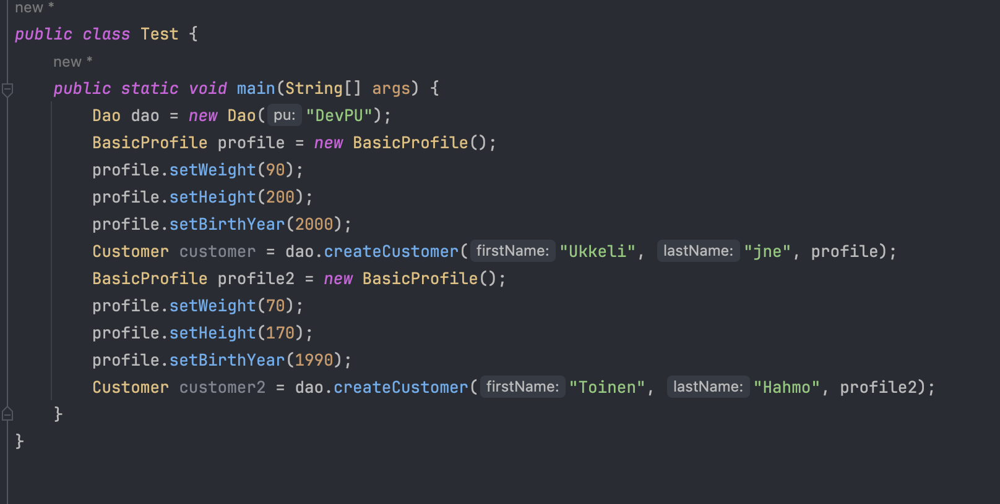
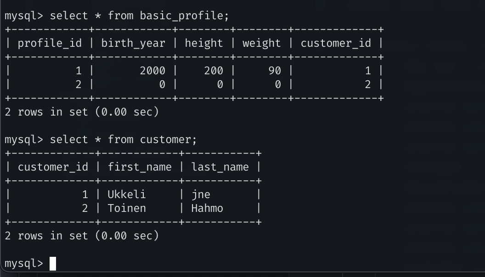
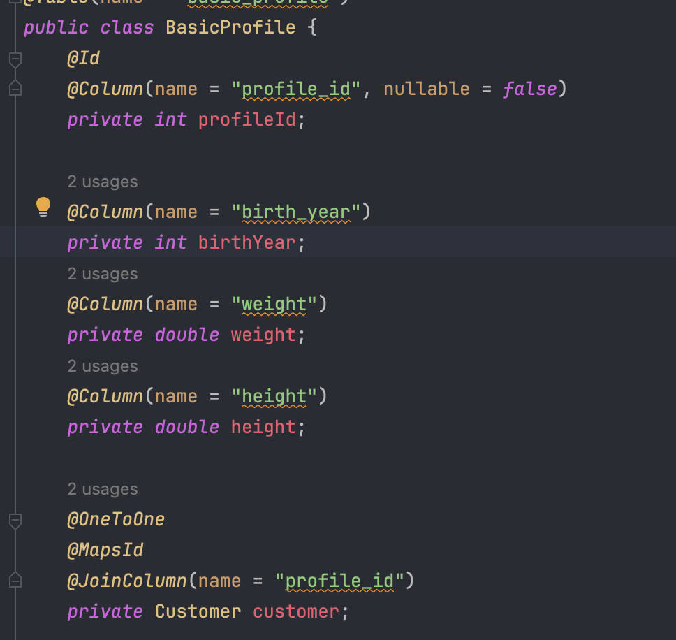
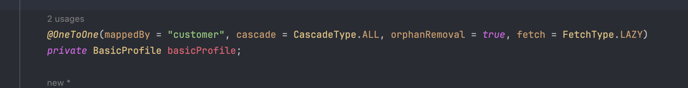

# Jpa one to one

### 1.

### 2.

    @MapsId in basic profile, and stop autogenerating id

in customer mappedBy = "customer" for the BasicProfile

**No change on db level.**

### 3.

## `@Inheritance(strategy = InheritanceType.SINGLE_TABLE)`

Single table to store all entities in the inheritance hierarchy. A discriminator column is used to identify the entity type.

## `@Inheritance(strategy = InheritanceType.TABLE_PER_CLASS)`

Each class in the hierarchy has its own table, but there is no relation between the tables (no foreign keys).

## `@Inheritance(strategy = InheritanceType.JOINED)`

Each class in the hierarchy is mapped to its own table, and rows are joined using a foreign key.

**did not went through implementing these further**
As I see I got the idea, but Java was giving me headache.
