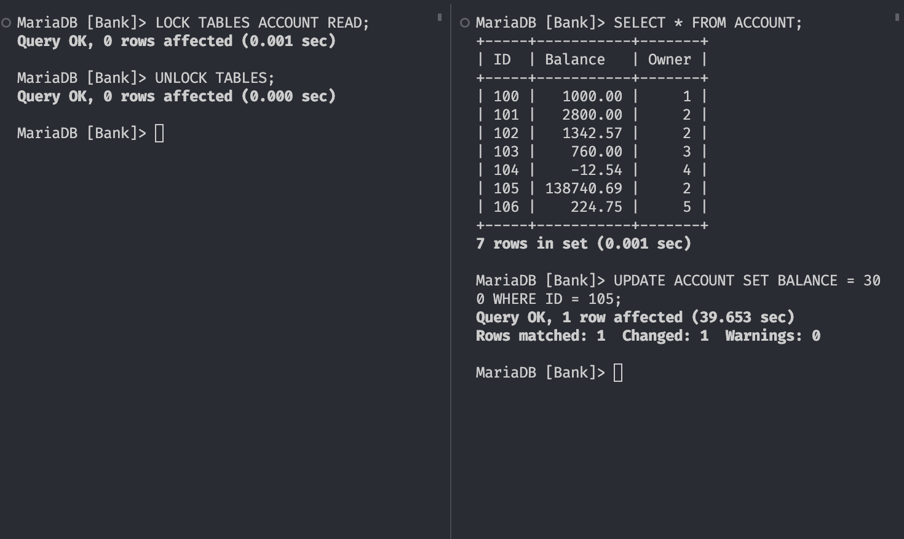
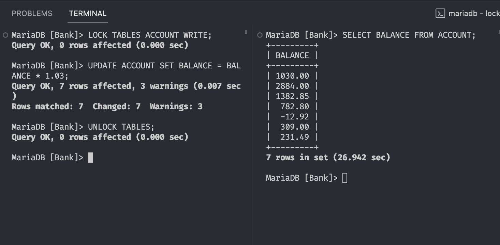
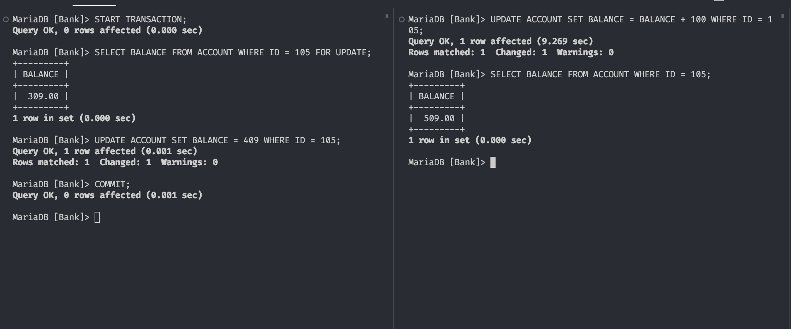

# Locks

## 1.

During the time the table was locked it could not receive any updates.
So session 2 was left waiting until `UNLOCK TABLES` was run in the other session.

## 2.

Session 2 got the updated data after the lock was released. Was left waiting prior.

## 3.

In the end the the balance was incremented by 200, which of course makes sense.

The record was locked for the duration of the transaction, and after it was committed the other session's query went in.

It is notable that the session 2 updated the record based on the data `after` the transaction and not `before`

## 4.

### 1. Session 1:

Begin a transaction to read a specific record from a table,
e.g. Account with `ID = 123`, using `SELECT * FROM Account WHERE ID = 123 LOCK IN SHARE MODE;`.
Setting a read lock on the record.

### 2. Session 2:

Attempt to read the same Account record with `ID = 123` using a basic SELECT statement.
Given the read lock set by Session 1, Session 2 is allowed to read the record concurrently.

### 3. Session 3:

Try to update the same Account record, e.g., `UPDATE Account SET Salary = Salary + 1000 WHERE ID = 123;`.
The operation is blocked because of the read lock set by Session 1, preventing any write operations until the lock is released.

### 4. Session 1:

Commit the transaction releasing the read lock on the `Account` record.

### 5. Session 3:

With the read lock released, update operation is now allowed to proceed, modifying the `Account`record.
