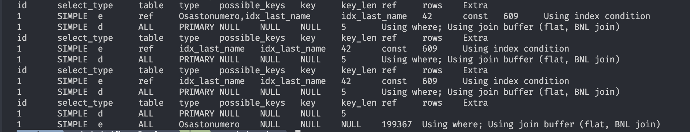
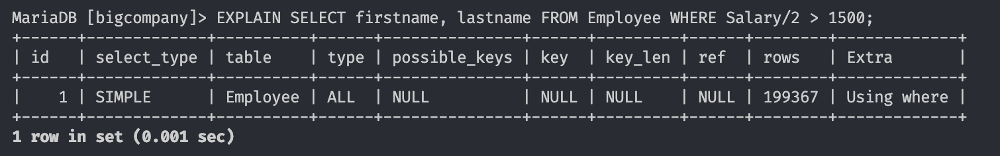
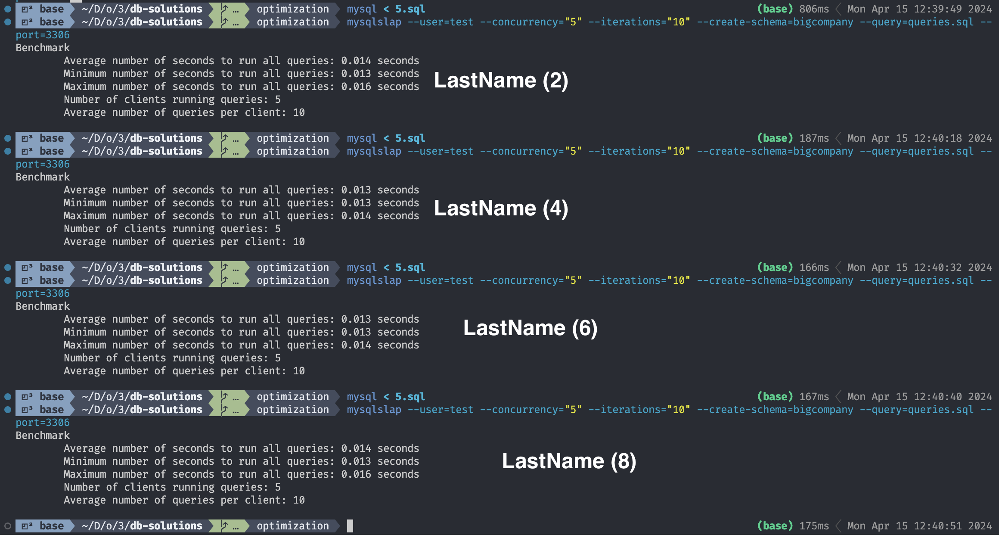

# Query optimization

## 1.

```sql
SHOW INDEX FROM bigcompany.employee;
```


`SHOW INDEX` (or `SHOW KEYS` or `SHOW INDEXES`) display indices for a table.
In the displayed information the column `Column_name` shows the column the index targets. There is also other information like how the data is sorted in the index and the size of the set etc.

I am not yet sure how compound indices work based on the documentation, but quick google shows that it should be possible. (indices that are based on multiple columns)

## 2.

```sql
EXPLAIN
SELECT e.FirstName,
  e.LastName,
  d.Name AS DepartmentName
FROM Employee e
  JOIN Department d ON e.DepartmentID = d.DepartmentID
WHERE e.LastName = "Pulkkinen";
```


The `EXPLAIN` command tells how the engine inteds to execute the query (indices to use).
In this case the keys `Osastonumero,idx_last_name` are possibly going to be used, which is great. (`idx_last_name` is the index for the lastname)

## 3.

In the image below the plans are listed as follows: no index clause in the query, `FORCE INDEX (idx_last_name)`, `USE INDEX (idx_last_name)`,`IGNORE INDEX (idx_last_name)`


In this case the first query would possibly use the `Osastonumero` index, where the `FORCE` and `USE` idx_last_name queries would not. This means that the query performance of the of the first one might differ from the two.

The last query with `IGNORE INDEX` drops the idx_last_name from the plan, which most likely would decrease the query performance considerably.

## 4.

Index:

```sql
CREATE INDEX idx_salary ON employee(Salary);
```

Query:

```sql
SELECT firstname, lastname FROM Employee WHERE Salary/2 > 1500;
```

129804 rows in set (0.156 sec)

Explaining shows that no index was used


Adding `USE INDEX` does not make the query faster, using `FORCE INDEX` makes it ever so slightly (from 0.156 sec to 0.147 sec) but it might not be relevant.

## 5.

sql run before each test:

```sql
ALTER TABLE employee DROP INDEX idx_last_name;
CREATE INDEX idx_last_name ON employee(LastName (count_here));
```

test command:

```sh
mysqlslap --user=test --concurrency="5" --iterations="10" --create-schema=bigcompany --query=queries.sql --port=3306
```

queries were basic select queries with `WHERE LastName = "some lastname"` etc.

Results:

So no real difference, 2 and 8 eight performed slightly worse than 4 and 6.

## 6.

The slow (very dumb dumb) query I would have used to test this:

```sql
SELECT a.EmployeeID, a.LastName, b.FirstName
FROM employee a, employee b
WHERE a.LastName LIKE '%Rojola%' AND b.LastName LIKE '%Mynttinen';
```

But I did not get the log file to print out anywhere. Tried to debug for long enough.
