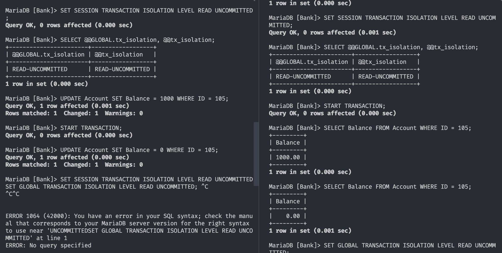

### 1. committed changes

```sql
START TRANSACTION;

UPDATE Account
SET Balance = Balance - 150.00
WHERE ID = 100;

UPDATE Account
SET Balance = Balance + 150.00
WHERE ID = 103;

COMMIT;

SELECT Balance
FROM Account
WHERE ID = 100;

SELECT Balance
FROM Account
WHERE ID = 103;
```

```
Balance
850.00
Balance
910.00
```

### 2. uncommited changes

```sql

START TRANSACTION;

UPDATE Account
SET Balance = Balance - 150.00
WHERE ID = 100;

UPDATE Account
SET Balance = Balance + 150.00
WHERE ID = 103;

ROLLBACK;

SELECT Balance
FROM Account
WHERE ID = 100;

SELECT Balance
FROM Account
WHERE ID = 103;
```

```
Balance
850.00
Balance
910.00
```

### 3. Two different connections

The balances do not change before committing.

### 4. Two different connections, commit

The balances changed (omg)

### 5.

1. Start TR1.
2. Start TR2.
3. TR2: Read balance of account 105. Result?
   138740.69
4. TR1: Decrease the balance of 105 to zero.
5. TR2: Read balance of account 105 Result?
   138740.69
6. Commit TR1.
7. Read balance of account 105 Result?
   0
8. Commit TR2.

### 6.

The Balance was read as 0 at step 5.5.

### 7.

Unchanged until both are committed

### 8.

It cancels the transactions that have not been committed. This happens after `innodb_lock_wait_timeout` seconds, which is defaulted to 50 on mariadb.

## Screenshot from the work

i did not take screenshots of the whole process, but here is one screenshot showing the two different instances of mariadb connections I had

