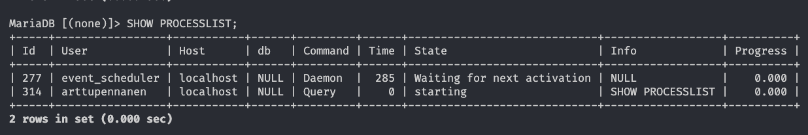
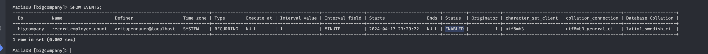
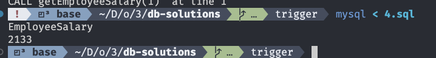

# Trigger

### 1.

Adding the table

```sql
CREATE TABLE EMPLOG (
  LogID INT AUTO_INCREMENT,
  EmployeeID INT,
  RecordingTime TIMESTAMP DEFAULT CURRENT_TIMESTAMP,
  PRIMARY KEY (LogID),
  FOREIGN KEY (EmployeeID) REFERENCES Employee(EmployeeID)
);
```

Creating a trigger

```sql
CREATE TRIGGER new_emp
AFTER
INSERT ON Employee FOR EACH ROW
INSERT INTO EMPLOG (EmployeeID, RecordingTime)
VALUES (NEW.EmployeeID, NOW());
```

Inserting

```sql
INSERT INTO employee (
    EmployeeID,
    LastName,
    FirstName,
    DepartmentID,
    StreetAddress,
    PostalCode,
    PhoneNumber,
    Salary
  )
VALUES (
    9001,
    'Ukko',
    'Yykaakoo',
    4,
    '123 tie',
    '00100',
    '1234567890',
    50000
  );
```

checking the trigger

```sql
SELECT \*
FROM EMPLOG;
```

it did work!

```sh
LogID   EmployeeID      RecordingTime
1       9001    2024-04-17 23:15:53
```

calling the `SHOW CREATE ...`

```sql
SHOW CREATE TRIGGER new_emp
```

outputs

| Trigger | sql_mode                                                                                     | SQL Original Statement                                                                                                                                                         | character_set_client | collation_connection | Database Collation | Created                |
| ------- | -------------------------------------------------------------------------------------------- | ------------------------------------------------------------------------------------------------------------------------------------------------------------------------------ | -------------------- | -------------------- | ------------------ | ---------------------- |
| new_emp | STRICT_TRANS_TABLES, ERROR_FOR_DIVISION_BY_ZERO, NO_AUTO_CREATE_USER, NO_ENGINE_SUBSTITUTION | CREATE DEFINER=`arttupennanen`@`localhost` TRIGGER new_emp AFTER INSERT ON Employee FOR EACH ROW INSERT INTO EMPLOG (EmployeeID, RecordingTime) VALUES (NEW.EmployeeID, NOW()) | utf8mb3              | utf8mb3_general_ci   | latin1_swedish_ci  | 2024-04-17 23:15:52.98 |

It shows trigger name, sql_name etc. Cool stuff. Shows who made, when and with what.

### 2.

I scheduled a new event like so

```sql
SET GLOBAL event_scheduler = ON;

CREATE TABLE EmployeeCount (
  Timestamp DATETIME PRIMARY KEY,
  EmployeeCount INT
);

CREATE EVENT record_employee_count ON SCHEDULE EVERY 1 MINUTE DO
INSERT INTO EmployeeCount (timestamp, EmployeeCount)
SELECT NOW(),
  COUNT(*)
FROM employee;
```

But no matter what I magic, the events dont appear.




### 3.

timTimestampestamp as DATETIME
EmployeeCount as INT

From the MariaDB documentation, the storage requirements are:

DATETIME: 8 bytes
INT: 4 bytes

Size per entry = 8 bytes (DATETIME) + 4 bytes (INT) = 12 bytes
1 gigabyte = 1073741824 bytes

Number of entries = 1073741824 / 12 = ~90 million

90 million minutes = ~171 years

### 4.

```sql
USE bigcompany;

DROP PROCEDURE IF EXISTS getEmployeeSalary;

DELIMITER $$

CREATE PROCEDURE getEmployeeSalary(IN emp_id INT, OUT emp_salary INT)
BEGIN
    SELECT Salary INTO emp_salary
    FROM employee
    WHERE EmployeeID = emp_id;
END$$

DELIMITER ;

SET @out_salary = 0;
CALL getEmployeeSalary(1, @out_salary);

SELECT @out_salary AS EmployeeSalary;
```


​
Very cool, athough pretty complex and probably leads to bad headaches in the long run.
