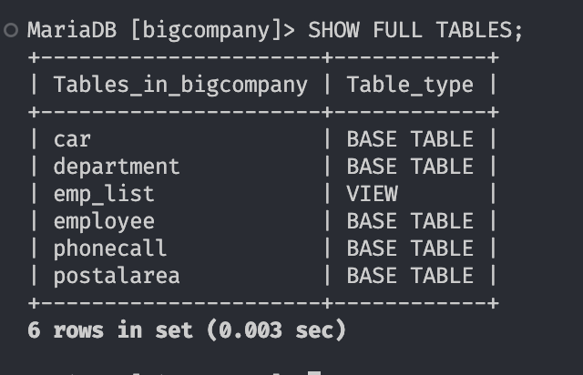
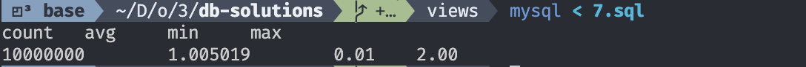
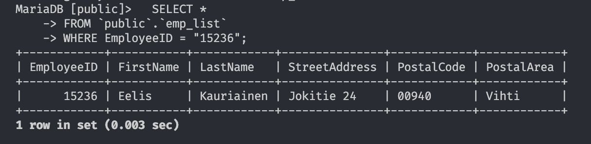

# Views

## 1.

```sql
USE bigcompany;

CREATE VIEW emp_list AS
SELECT e.EmployeeID,
  e.FirstName,
  e.LastName,
  e.StreetAddress,
  p.PostalCode,
  p.PostalArea
FROM Employee e
  JOIN Postalarea p ON e.PostalCode = p.PostalCode;
```

## 2.

```sql
USE bigcompany;

SELECT *
FROM emp_list
WHERE LastName = "Virtanen";
```

## 3.



The `emp_list` is a view, others are just "basic" tables.

## 4.

The data is interchangeable. Changes to `Employee` are reflected in `emp_list` and vice versa.

## 5.


## 6.

The value of the PostalArea with name Viikki was modified, and thus all emp_list that had 00940 now have it set o to Vihti, which is not true.

This could have been prevented by replacing the `PostalCode` of the record instead.

## 7.



## 8.

```
mysql -u dbuser -pdbpass public

SELECT \*
FROM `public`.`emp_list`
WHERE EmployeeID = "15236";
```



Works well.

## 9.


`UPDATE` fails

## 10.

After update, the record is no longer part of the view.

## 11.

ERROR 1369 (44000) at line 12: CHECK OPTION failed `bigcompany`.`bigsalaries2`

Does not allow to update the record.
